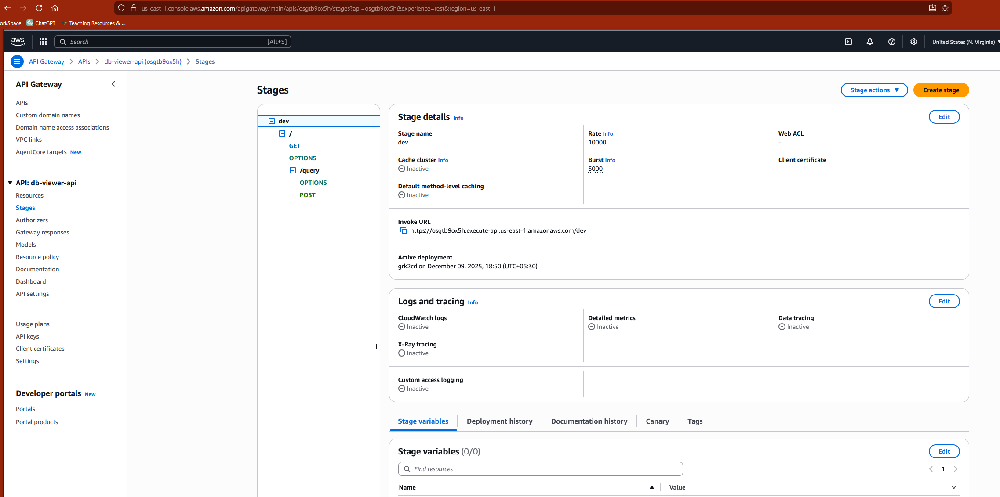
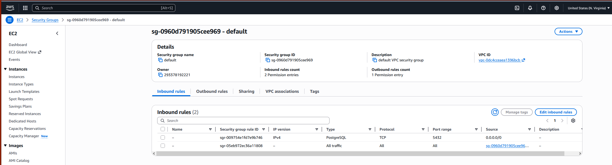

🏗️ Architecture – Incident Data Viewer

## MAIN FEATURE WORKED - API GATEWAY + LAMBDA

## WORKED

# Dynamic Database Viewer (Spring Boot + AWS Lambda + API Gateway + RDS)

This project is a dynamic database table viewer built using:

- Spring Boot (MVC + Thymeleaf)
- AWS Lambda (Serverless)
- API Gateway (HTTP access)
- Amazon RDS (PostgreSQL)
- Java 17
- Maven

It allows users to select database tables from a UI and view their data dynamically.

---

## ✅ Features

- Serverless Spring Boot application running inside AWS Lambda
- UI built using Thymeleaf templates
- Multi-table selection using custom dropdown with checkboxes
- Dynamic rendering of table data
- Works with both:
    - Local DB (H2 optional)
    - AWS RDS PostgreSQL
- Fully integrated with API Gateway
- Stateless by design (no session usage)

---

## ✅ Architecture
Browser
|
v
API Gateway (Stage: /dev)
|
v
AWS Lambda (Spring Boot Fat JAR)
|
v
Amazon RDS (PostgreSQL)

## ✅ Update Environment Variables and handler in lambda
SPRING_DATASOURCE_URL=jdbc:postgresql://<rds-endpoint>:5432/postgres

SPRING_DATASOURCE_USERNAME=postgres

SPRING_DATASOURCE_PASSWORD=****

SPRING_PROFILE=aws

**Handler -** com.example.demo.UnifiedLambdaHandler::handleRequest

## ✅ Open traffic in RDS and make it public accessible

