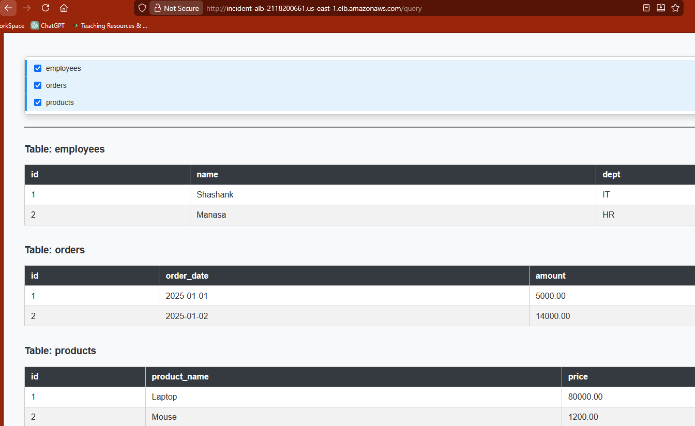

📌 Project Overview

This project is a production-ready web application built with:

Spring Boot (Java 17)

Thymeleaf for server-side UI rendering

PostgreSQL (AWS RDS) for production database

H2 for local development

Docker + ECS Fargate for containerized deployment

Application Load Balancer (ALB) for public traffic routing

The application allows users to:

Dynamically list all database tables

Select multiple tables using a dropdown with checkboxes

Fetch and render data from selected tables dynamically

Operate fully stateless (no session usage)

🏗️ Final Architecture

User Browser
↓
Application Load Balancer (ALB)
↓
ECS Fargate Service
↓
Spring Boot + Thymeleaf (Port 8080)
↓
PostgreSQL RDS

⚙️ Technology Stack

| Layer         | Technology                      |
| ------------- | ------------------------------- |
| Language      | Java 17                         |
| Framework     | Spring Boot 2.7.18              |
| UI            | Thymeleaf                       |
| Database      | PostgreSQL (RDS), H2 (Local)    |
| Container     | Docker                          |
| Orchestration | ECS Fargate                     |
| Load Balancer | Application Load Balancer (ALB) |
| Build Tool    | Maven                           |

🚀 Local Development

mvn clean package

docker build -t incident-data-viewer:local .

docker run -p 8080:8080 -e SPRING_PROFILES_ACTIVE=local incident-data-viewer:local

http://localhost:8080/

http://localhost:8080/ping

☁️ ECS Deployment – Required Environment Variables

| Variable                     | Purpose      |
| ---------------------------- | ------------ |
| `SPRING_PROFILES_ACTIVE`     | aws          |
| `SPRING_DATASOURCE_URL`      | RDS JDBC URL |
| `SPRING_DATASOURCE_USERNAME` | RDS Username |
| `SPRING_DATASOURCE_PASSWORD` | RDS Password |

## Steps followed to push image to AWS
- Created ECR in AWS
- Connect to ECR from local - 
  - aws ecr get-login-password --region us-east-1 | docker login --username AWS --password-stdin 403353369362.dkr.ecr.us-east-1.amazonaws.com/incident-data-viewer
- Build docker image -
  - docker build -t incident-data-viewer:local .
- docker tag incident-data-viewer:local 403353369362.dkr.ecr.us-east-1.amazonaws.com/incident-data-viewer:latest
- docker push 403353369362.dkr.ecr.us-east-1.amazonaws.com/incident-data-viewer:latest

✅ PHASE 2 — IAM (ECS Execution Role)

This allows ECS to:

Pull images from ECR

Write logs to CloudWatch

Step 2.1: Create IAM Role

Go to IAM → Roles → Create Role

Select:

Trusted entity: AWS Service

Use case: Elastic Container Service

Choose:

Elastic Container Service Task

Attach Policies:

AmazonECSTaskExecutionRolePolicy

Role name:

ecsTaskExecutionRole

Create role

✅ PHASE 3 — ECS Cluster (Fargate)

Step 3.1: Create ECS Cluster

Go to ECS → Clusters

Click Create Cluster

Choose:

Cluster name: incident-cluster

Infrastructure: AWS Fargate

Create

✅ PHASE 4 — ECS Task Definition (MOST IMPORTANT)

This defines:

Docker image

Port

Env variables (RDS)

Logging

Step 4.1: Create Task Definition

ECS → Task Definitions

Click Create new Task Definition

Choose:

Launch type: Fargate

Step 4.2: Task Definition Settings

Field	Value

Task family	incident-task

CPU	512

Memory	1024

Task role	None

Execution role	ecsTaskExecutionRole

OS	Linux

Architecture	X86_64

Step 4.3: Container Definition

Field	Value

Name	incident-container

Image	123456789012.dkr.ecr.us-east-1.amazonaws.com/incident-data-viewer:latest

Port	8080

Protocol	TCP

Step 4.4: Environment Variables (CRITICAL)

Add:

Name	Value

SPRING_PROFILES_ACTIVE	aws

SPRING_DATASOURCE_URL	jdbc:postgresql://<rds-endpoint>:5432/<db>

SPRING_DATASOURCE_USERNAME	<db-user>

SPRING_DATASOURCE_PASSWORD	<db-password>

Step 4.5: Logging

Enable:

CloudWatch logs

Log group:

/ecs/incident-task

✅ PHASE 5 — VPC & Security Groups (Create Task Definition)

You need 3 security groups:

Component	Port

ALB	80

ECS	8080

RDS	5432

Step 5.1: Create ALB Security Group

Inbound:

HTTP 80 from 0.0.0.0/0

Step 5.2: Create ECS Security Group

Inbound:

TCP 8080 from ALB security group ONLY

Step 5.3: RDS Security Group

Inbound:

TCP 5432 from ECS security group ONLY

✅ PHASE 6 — Application Load Balancer (ALB)

Step 6.1: Create ALB

Go to EC2 → Load Balancers

Create Application Load Balancer

Internet facing

Select at least 2 public subnets

Assign ALB Security Group

Step 6.2: Create Target Group

Field	Value

Type	IP

Protocol	HTTP

Port	8080

Health Check	/ping

✅ PHASE 7 — ECS Service (Connect Everything)

Now we attach ECS to ALB.

Step 7.1: Create ECS Service

ECS → Clusters → incident-cluster

Create Service:

Launch type: Fargate

Task definition: incident-task

Desired tasks: 1

Step 7.2: Networking

Select same VPC as ALB

Subnets: public

Assign ECS Security Group

Auto-assign public IP

Step 7.3: Load Balancer Mapping

Type: Application Load Balancer

Listener: 80

Target Group: incident-tg

Container: incident-container

Container port: 8080

Create Service

## FINALLYYY 

